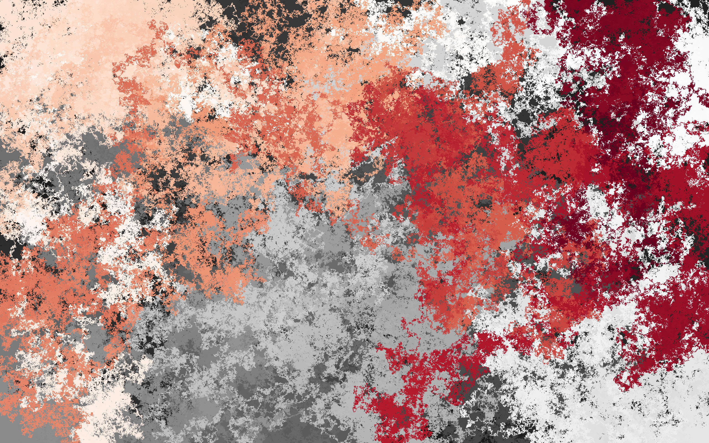
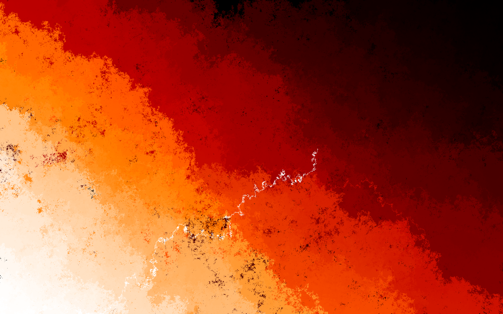

# Image Generation and Scaling Tool





## Overview

This project consists of two main Python scripts: **ImageGenerator.py** and **ImageScaler.py**. These scripts allow users to generate random images with specified resolutions and scale existing images to desired sizes. There is also a Subreddit (r/randimageMW) which showcases some of the images I and other generated. 

## Prerequisites

- Python 3.x
- Required libraries: `randimage`, `matplotlib`, `Pillow`
  
You can install the required libraries using pip:

```bash
pip install randimage matplotlib Pillow
```

## Usage

### ImageGenerator.py

**Description**: Generates random images of a specified resolution and saves them in a designated directory.

**Command**:
```bash
python3 ImageGenerator.py <image_name> <resolution> [num_images]
```

- `<image_name>`: Name of the image file to generate (without file extension).
- `<resolution>`: Resolution of the image in the format `widthxheight` (e.g., `1440x900`).
- `[num_images]`: (Optional) Number of images to generate. If not specified, defaults to 1.

**Example**:
```bash
python3 ImageGenerator.py wallpaper 1440x900 3
```

**Output**: Generated images are saved in `Images/<width>x<height>/` directory. The time taken for image generation is logged in `time.txt`.

### ImageScaler.py

**Description**: Scales an existing image to a specified resolution and saves it to a specified path.

**Command**:
```bash
python3 ImageScaler.py <image_path> <resolution> <save_path>
```

- `<image_path>`: Path to the image file to be scaled.
- `<resolution>`: Desired resolution in the format `widthxheight` (e.g., `200x200`).
- `<save_path>`: Path where the scaled image will be saved.

**Example**:
```bash
python3 ImageScaler.py Images/100x100/wallpaper.png 200x200 ScaledImages/test.png
```

**Output**: The scaled image is saved at the specified `save_path`.

## Logging

The time taken for each image generation is logged in a file named `time.txt`. Each entry includes:

- Resolution and image name.
- Time taken for generation.
- Device information and current date/time.
- Number of images generated.

**Example of `time.txt`**:
```
1170x2532/hi: 226.93339705467224
Device: posix.uname_result(sysname='Darwin', nodename='192.168.1.100', release='23.2.0', version='Darwin Kernel Version 23.2.0: Wed Nov 15 21:53:34 PST 2023; root:xnu-10002.61.3~2/RELEASE_ARM64_T8103', machine='arm64')
Date and Time: Wed Feb 14 15:28:49 2024
Number of Images: 3
```

## Note

Most generated wallpapers are not included in this repository, except for some high-quality examples.

## How the Library Works

For more details on the underlying library used for image generation, visit the [randimage documentation](https://pypi.org/project/randimage/#description).

## How the Code Works

This project consists of two primary scripts, **ImageGenerator.py** and **ImageScaler.py**, each with distinct functionalities for generating and scaling images. Below is a breakdown of how each script operates:

### ImageGenerator.py

**Purpose**: This script generates random images of specified resolutions and saves them to the designated directory.

1. **Command-Line Arguments**:
   - The script accepts up to three arguments: `image_name`, `resolution`, and an optional `num_images`.
   - It validates the input to ensure the correct number of arguments is provided and checks if the image name does not contain a file extension.

2. **Resolution Handling**:
   - The `resolution` argument is parsed to extract width and height.
   - The script checks that both dimensions are positive integers and within a valid range (greater than 0 and less than 4K resolution).

3. **Directory Creation**:
   - The script creates a directory for the specified resolution if it does not already exist. This helps organize the generated images.

4. **Image Generation**:
   - If only one image is requested, the script calls `generateOneImage()`, which generates a random image using the `randimage` library and saves it as a PNG file.
   - If multiple images are requested, the script uses `generateMultipleImages()`, iterating to generate the specified number of images.

5. **Logging**:
   - After generating the images, the script logs the time taken for the generation process in `time.txt`, along with device information and the number of images created.

### ImageScaler.py

**Purpose**: This script scales an existing image to a specified resolution and saves it to a user-defined location.

1. **Command-Line Arguments**:
   - The script requires three arguments: `image_path`, `resolution`, and `save_path`.
   - It checks that the provided image path exists and verifies that the resolution is valid.

2. **Image Scaling**:
   - Upon validating the inputs, the script opens the specified image file using the Pillow library.
   - The original resolution of the image is printed for reference.
   - The image is resized to the desired resolution using the `resize()` method.

3. **Saving the Scaled Image**:
   - The scaled image is saved to the specified `save_path`, and the new resolution is printed to confirm the operation.

### Error Handling
Both scripts include error handling to provide informative messages to the user when inputs are invalid or when files and directories cannot be accessed or created.

